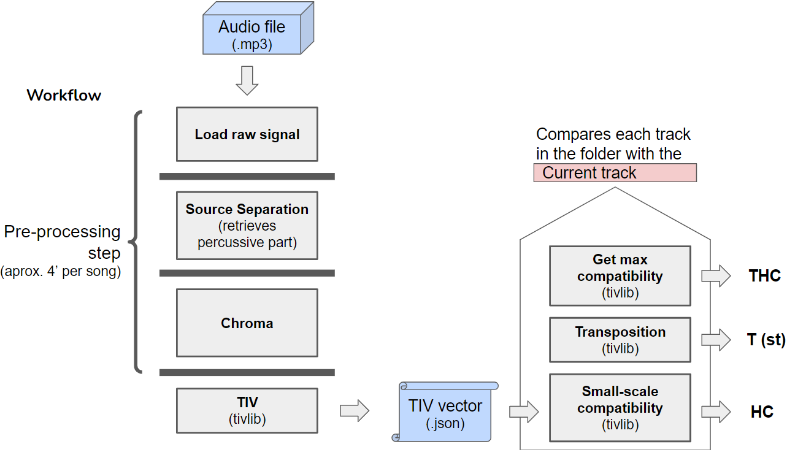

<!-- README.md is generated from README.Rmd. Please edit that file -->

# Harmonic mix system

This repository contains the code used for my Master Thesis _Towards a new compatibility measure for harmonic EDM mixing_. [Link text Here](https://zenodo.org/record/5554688#.YiaRT4MzZNh)

DJ track selection can benefit from software-generated recommendations that optimise harmonic transitions. Emerging techniques (such as Tonal Interval Vectors) permit the definition of new metrics for harmonic compatibility (HC) estimation that improve the performance of existing applications. Thus, the aim of this study is to provide the DJ with a new tool to improve his/her musical selections. We present a software package that can estimate the HC between digital music recordings, with a particular focus on modern dance music and the workflow of the DJ. The user must define a target track for which the calculation is to be made, and obtains the HC values with respect to each track in the music collection, expressed as a percentage. The system also calculates a pitch transposition interval for each candidate track that, if applied, maximizes the HC with respect to the target track. Its graphical user interface allows the user to easily run it in parallel to the DJ software of choice during live performances. The system, tested with musically experienced users, generates pitch transposition suggestions that improve mixes in 73.7% of cases.

## Algorithm workflow

The main module of the programme deals with the analysis of audio tracks using Music Information Retrieval techniques. They are first source-separated to remove the percussive elements, with no melodic information. A single chroma vector is computed as the mean of the NNLSChroma from each frame, that then is converted into a Tonal Interval Vector (TIV). The HC is calculated as the measure score between the pairs TIVs of candidate and target track. 



## Requirements
This repository needs:

* librosa~=0.8.0
* numpy~=1.19.5
* essentia~=2.1b6.dev374
* matplotlib~=3.3.4

## How to use it

You can either use the graphical interface or use the functions defined in main.py.

### Graphical User Interface (tkinter_GUI.py)

To open it, you must run tkinter_GUI.py. The graphical interface allows you to load audio tracks in .mp3 format contained in a folder. Then you analyze them (which takes about 4 minutes per track) and you're all set! The values have been saved in an "annotations" folder, so you won't have to re-analyze your songs the next time you use the program. Now all you have to do is select the target track for which you want to find a harmonically compatible candidate track. Double-click on the target track and three columns of values will be displayed on the right. HC(%) is the harmonic compatibility between the target track and each of the other tracks in the folder, all in their original versions. T(st) is the suggested pitch transposition interval (in semitones) that would maximize harmonic compatibility. THC(%) is the resulting harmonic compatibility if the suggested pitch transposition were applied. You can change the target track and the column values will be updated.

### Code (main.py)

This module contains two functions with which you can calculate the harmonic compatibility between tracks and in all possible pitch transpositions.


analyze_song (song_path):

Computes the TIV from a given song (path)
    0) Checks if the file exists
    1) Loads the song with MonoLoader (essentia)
    2) Cuts the song
    3) Retrives percusive part applying source separation (librosa)
    4) Computes NNLS chroma (essentia)
    5) Computes TIV (tivlib)
    6) Saves results

Takes as input
The path of the track you want to analyze

compare_songs(current_song_path, candidate_song_path, transpose_candidate=0):

Computes harmonic compatibility between two given songs (paths). Also suggests the amount of pitch shift transpisition to maximize the harmonic compatibility

Takes as input:
current_song_path=The path of the target track
candidate_song_path=The path of the candidate track
transpose_candidate=An interval (in positive or negative semitones) with which the pitch transposition of the candidate track will be simulated.

Returns as output:

HC(%)=The harmonic compatibility between the target track and each of the other tracks in the folder, all in their original versions. 
T(st)=The suggested pitch transposition interval (in semitones) that would maximize harmonic compatibility. 
THC(%)=The resulting harmonic compatibility if the suggested pitch transposition were applied.


### Example
```python
...
import os
import os.path
import ntpath
from json import JSONEncoder
import json
import librosa
import numpy as np
from essentia.standard import LogSpectrum, MonoLoader, Windowing, \
  Spectrum, FrameGenerator, NNLSChroma #, HPCP
from harmonic_mix.tivlib import TIV

genre = 'progressive_house/'
current_song = "Blanka Barbara - Lost in Digital Fog (Original) - 11A - 124"
candidate_song = "Teklix - The Tribal Code - 6A - 124"
current_song_path = "harmonic_mix/music/" + genre + current_song + ".mp3"
candidate_song_path = "harmonic_mix/music/" + genre + candidate_song + ".mp3"
analyze_song(current_song_path)
analyze_song(candidate_song_path)
harmonic_compatibility, pitch_shift, min_small_scale_comp = \
    compare_songs(current_song_path, candidate_song_path,1)
pitch_shift_sign = ""
if pitch_shift > 0:
    pitch_shift_sign = "+"

print("Harmonic compatibility: ", round(harmonic_compatibility, 2), "%")
print("Recommended pitch shift: ", pitch_shift_sign , pitch_shift, "st")
print("Resulting harmonic compatibility (after pitch shifting): ",
      round(min_small_scale_comp, 2), "%")
...
```
as.integer(encode(pc_chord(x)))
#> [1] 8210
```

Similarly, the following code expresses the chord as a pitch-class set,
and then encodes the pitch-class set as an integer.

``` r
pc_set(x)
#> Pitch-class set: 0 4 7
as.integer(encode(pc_set(x)))
#> [1] 145
```
